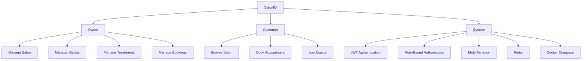

<div align="center">


<a href="https://github.com/ParthCode01">

</a>

<br>

<a href="https://github.com/ParthCode01">

</a>
<a href="https://www.linkedin.com/in/parth-sharma-471643365">

</a>
<a href="https://leetcode.com/u/Parth_Code001/">

</a>

<br><br>


<br><br>

> **I build secure backend systems, practical full-stack applications, and solve problems every day.**

</div>

---

<div align="center">

## ⚡ THE STACK

<table>
<tr>
<td align="center" width="180">

### ☕ Backend


**Java**<br/>
**Spring Boot**<br/>
**Spring Security**<br/>
**REST APIs**<br/>
**JPA / Hibernate**

</td>

<td align="center" width="180">

### ⚛️ Frontend


**React**<br/>
**JavaScript**<br/>
**HTML**<br/>
**CSS**

</td>

<td align="center" width="180">

### 🗄️ Data


**MySQL**<br/>
**Redis**<br/>
**Database Design**<br/>
**Caching**

</td>

<td align="center" width="180">

### 🐳 DevOps


**Docker**<br/>
**Docker Compose**<br/>
**Git**<br/>
**GitHub**

</td>
</tr>
</table>

</div>

---

## 👨‍💻 About Me

<table>
<tr>
<td width="55%" valign="top">

### Building

I'm a B.Tech CSE student focused on becoming a **strong Java Backend / Software Engineer**.

I like building applications where I have to think about more than just the UI:

* Authentication & authorization
* REST API architecture
* Database relationships
* Multi-tenancy
* Caching
* Concurrency
* Containerization
* Deployment architecture

</td>

<td width="45%" valign="top">

### Currently sharpening

```text
Java
 └─ Spring Boot
     ├─ Security
     ├─ JWT
     ├─ JPA / Hibernate
     ├─ Redis
     └─ REST APIs

Full Stack
 └─ React
     ├─ Components
     ├─ State
     ├─ API Integration
     └─ Routing

DevOps
 └─ Docker
     └─ Docker Compose

DSA
 ├─ LeetCode
 └─ Codeforces
```

</td>
</tr>
</table>

---

# 🚀 Featured Projects

<div align="center">

## 💈 SalonIQ

### Multi-Tenant Salon Booking & Queue Management SaaS


<br><br>


</div>

SalonIQ is a production-oriented SaaS application designed around **salon owners, stylists and customers**.

### What makes it interesting?



**Core features**

* Multi-tenant architecture
* JWT authentication
* Role-based authorization
* Owner / Customer workflows
* Stylist management
* Treatment management
* Appointment booking
* Queue / waitlist system
* Stylist working hours
* Conflict detection
* Redis integration
* Dockerized application
* MySQL persistence

**Stack**

`Java` `Spring Boot` `Spring Security` `JWT` `JPA` `MySQL` `Redis` `Docker` `React`

<br>

<a href="https://github.com/ParthCode01">

</a>

---

## 🏥 Hospital Management System

<div align="center">


</div>

A secure backend application for managing hospital workflows through REST APIs.

### Features

* Doctor management
* Patient management
* Doctor-patient relationships
* User authentication
* JWT authentication
* Role-based authorization
* Spring Security
* BCrypt password hashing
* RESTful APIs

`Java` `Spring Boot` `Spring Security` `JWT` `MySQL` `JPA`

<div align="center">

<a href="https://github.com/ParthCode01/Hospital-Management-System-">

</a>

</div>

---

## 🤖 Student Dropout Prediction

<div align="center">


</div>

Machine learning project that predicts whether a student is at risk of dropping out.

**Stack**

`Python` `Scikit-learn` `Pandas` `NumPy`

**Highlights**

* Data preprocessing
* Feature analysis
* Model training
* Prediction pipeline
* Supervised machine learning

<div align="center">

<a href="https://github.com/ParthCode01/Student-DropOut-Prediction-Model-">

</a>

</div>

---

# 🧠 Problem Solving

<div align="center">


<br><br>


<br><br>

**Algorithms • Data Structures • Problem Solving • Competitive Programming**

</div>

---

# 🏆 Achievements

<div align="center">

<table>
<tr>

<td align="center" width="300">

🏆

### Algo Wars

**Hackathon Winner**

Led the team to build and present a working solution under time constraints.

</td>

<td align="center" width="300">

💻

### 200+ Problems

**LeetCode**

Consistent focus on DSA, algorithms and interview problem solving.

</td>

<td align="center" width="300">

🚀

### Production Mindset

**Real Applications**

Building projects around authentication, databases, caching and deployment.

</td>

</tr>
</table>

</div>

---

# 📊 GitHub Activity

<div align="center">


</div>

---

# 📈 What I'm Building Toward

<div align="center">

```text
                     SOFTWARE ENGINEER
                            │
              ┌─────────────┼─────────────┐
              │             │             │
           BACKEND       FRONTEND       DSA
              │             │             │
        Spring Boot       React       Algorithms
              │             │             │
        Spring Security  JavaScript   Problem Solving
              │             │             │
            Redis        APIs         LeetCode
              │             │             │
           Docker       Full Stack    Codeforces
              │             │             │
              └─────────────┼─────────────┘
                            │
                     SYSTEM DESIGN
```

</div>

---

# 🎯 Current Focus

<table>
<tr>
<td width="25%" align="center">

### ☕ JAVA

Spring Boot
Security
JPA
REST APIs

</td>

<td width="25%" align="center">

### ⚛️ REACT

Components
State
API Integration
Full Stack

</td>

<td width="25%" align="center">

### 🐳 DEVOPS

Docker
Compose
Containers
Deployment

</td>

<td width="25%" align="center">

### 🧠 DSA

LeetCode
Codeforces
Algorithms
Problem Solving

</td>
</tr>
</table>

---

# 💭 Developer Philosophy

<div align="center">

### **Don't just make it work. Understand why it works.**

<br>

`Learn → Build → Break → Debug → Improve → Repeat`

</div>

---

# 🤝 Let's Connect

<div align="center">

<a href="https://github.com/ParthCode01">

</a>

<a href="https://www.linkedin.com/in/parth-sharma-471643365">

</a>

<a href="https://leetcode.com/u/Parth_Code001/">

</a>

<br><br>

### Thanks for visiting.

**Explore the repositories. Follow the build.**

<br>


</div>
